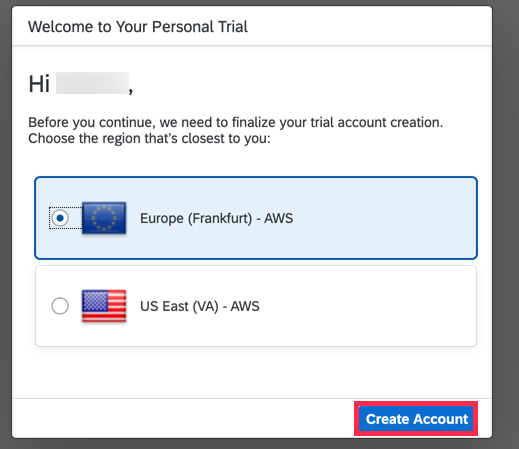
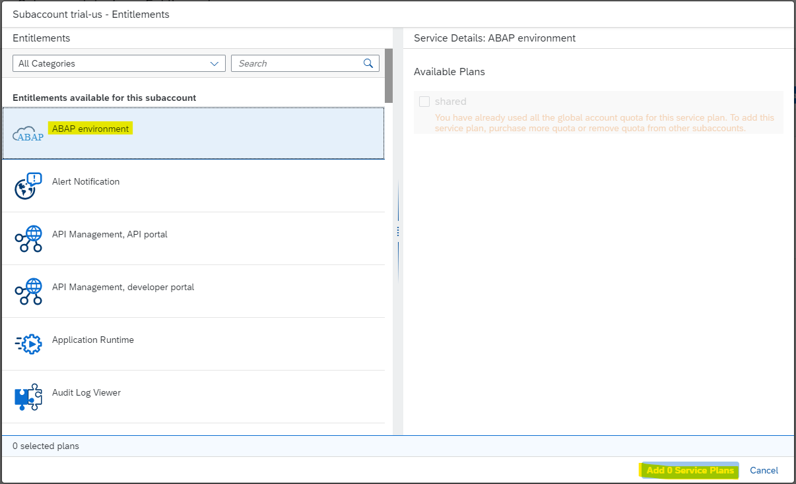

# ABAP Cloud Account not working

## Error Description

During the creation steps according to [this tutorial](https://developers.sap.com/tutorials/abap-environment-trial-onboarding.html) multiple errors occur.

`add images here`

This can be caused be problems on the hardware in Europe.

## Solution

If you are at the beginning, simply select US at this point:

If you already created an account, then just create a second one in the US.

For this go to the Subaccounts-Overview-Page and click then on create **new Subaccount**:

Fill the Pop-Up as described below &rarr; please replace 49deb606trial-us with `YOUR_ID-us`:

Click then on the newly created subaccount and `Enable Cloud Foundry`:

after short time, this should be done and then via click on `Create Space` this one can be created as suggested and the result should looks as below:

On the left side, select `Entitlements` (you should be still on your `trial-us`-level) and select `Configure Entitlements` - the button should then toogle and `Add Service Plans` should be then available:

If your `ABAP environment`-Quota is not assigned to an other Subaccount, then you should now be able to add it here:

With this done, you can now try again the booster, but most of the steps should have already happened &rarr; Select `trial-us` at the beginning of the wizard!